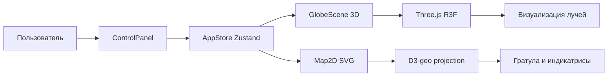
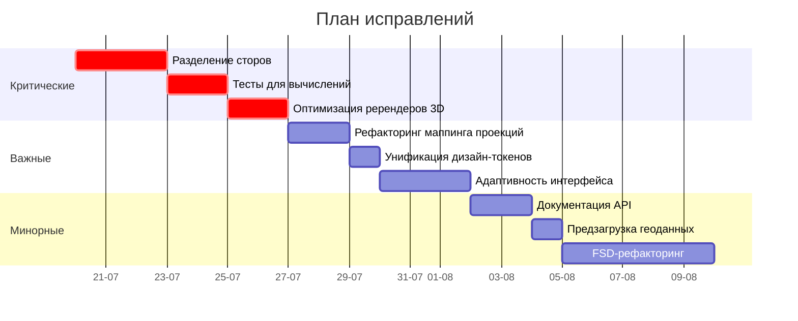

## 📊 Краткий обзор проекта

Проект представляет собой интерактивный симулятор картографических проекций, визуализирующий связь между 3D-глобусом и 2D-картой. Стек технологий современный: Vite + React 19 + TypeScript + Tailwind CSS + Zustand + Three.js + D3.js 【turn0fetch0】. Это SPA без бэкенда, что подходит для учебного/демонстрационного проекта.



## 🚨 Критические проблемы (необходимо исправить в первую очередь)

### 1. **Архитектура: Единый стор Zustand — слишком много ответственностей**

**Проблема:** В `useAppStore.ts` хранятся параметры проекции, геоданные и экшены. Это нарушает принцип разделения ответственности (Single Responsibility Principle) 【turn0fetch0】.

**Почему критично:** По мере роста проекта стор станет "божественным объектом" (God Object). Любое изменение затронет весь стор, что усложнит тестирование и поддержку.

**Как исправить:**
```typescript
// ❌ Плохо: всё в одном сторе
useAppStore({
  projectionParams: {...},
  geoData: {...},
  actions: {...}
})

// ✅ Хорошо: разделить на доменные хранилища
useProjectionStore() // Параметры проекции
useGeoDataStore()    // Геоданные
useUIStore()         // Состояние интерфейса (открытые панели, модалки)
```

**Шаги для джуниора:**
1. Создай `src/store/projectionStore.ts` с параметрами проекции и экшенами для них
2. Создай `src/store/geoDataStore.ts` с загрузкой и хранением геоданных
3. Создай `src/store/uiStore.ts` с состоянием интерфейса (открытые панели, модалки)
4. В `App.tsx` используй `combine` из Zustand для объединения сторов
5. Обнови импорты во всех компонентах

### 2. **Тестирование: Отсутствие тестов для критических вычислений**

**Проблема:** Не тестируются WebGL/Canvas и SVG-пути из-за "хрупкости" 【turn0fetch0】. Однако ключевые функции, такие как `getD3Projection()`, не имеют unit-тестов.

**Почему критично:** Ошибка в маппинге проекций приведет к неправильной визуализации, что является ключевой функцией приложения.

**Как исправить:**
```typescript
// src/utils/projectionMapper.test.ts
describe('getD3Projection', () => {
  it('должна возвращать Mercator для cylindrical conformal', () => {
    const proj = getD3Projection('cylindrical', 'conformal', 0, 0, 0);
    expect(proj).toBeInstanceOf(d3.geoMercator);
  });

  it('должна правильно применять вращение по долготе', () => {
    const proj = getD3Projection('cylindrical', 'conformal', 45, 0, 0);
    expect(proj.rotate()).toEqual([-45, 0, 0]);
  });
});
```

**Шаги для джуниора:**
1. Создай тестовые файлы для всех утилит в `src/utils/`
2. Добавь тесты на граничные случаи (нулевые координаты, максимальные значения)
3. Настрой CI для запуска тестов при каждом PR (уже есть в `.github/workflows/ci.yml`)
4. Добавь покрытие кода (coverage) в `vitest.config.ts`

### 3. **Производительность: Ререндеры 3D-сцены при изменении параметров 2D-проекции**

**Проблема:** При изменении параметров проекции (например, стандартных параллелей) ререндерится как 2D-карта, так и 3D-сцена, хотя 3D-сцене нужно только обновить лучи.

**Почему критично:** Ненужные ререндеры 3D-сцены приводят к падению FPS, особенно на слабых устройствах.

**Как исправить:**
```typescript
// GlobeScene.tsx
import { useFrame } from '@react-three/fiber';

function GlobeScene() {
  const projectionParams = useProjectionStore(s => s.projectionParams);
  const linesRef = useRef<THREE.Group>(null);

  useFrame(() => {
    // Обновляем только лучи, не перерендеривая всю сцену
    if (linesRef.current) {
      updateProjectionLines(linesRef.current, projectionParams);
    }
  });

  return (
    <group ref={linesRef}>
      {/* Лучи проекции */}
    </group>
  );
}
```

**Шаги для джуниора:**
1. Раздели 3D-сцену на статическую часть (глобус) и динамическую (лучи)
2. Используй `useMemo` для вычисления геометрии лучей
3. Применяй `useFrame` для обновления только нужных объектов
4. Добавь `react-three/fiber`'s `useThree` для управления камерой

## ⚠️ Важные проблемы (влияют на качество и поддерживаемость)

### 4. **Код: Дублирование логики маппинга проекций**

**Проблема:** В `projectionMapper.ts` используется жестко заданная таблица маппинга `(family × distortion)` → D3-проекция 【turn0fetch0】. Если добавить новую проекцию, придется изменять код в нескольких местах.

**Как исправить:**
```typescript
// src/utils/projectionConfig.ts
export const projectionConfig = {
  cylindrical: {
    conformal: { d3Projection: 'Mercator', name: 'Меркатор' },
    equalArea: { d3Projection: 'CylindricalEqualArea', name: 'Равновеликая цилиндрическая' },
    equidistant: { d3Projection: 'Equirectangular', name: 'Равнопромежуточная' }
  },
  // ... другие семейства
} as const;

// src/utils/projectionMapper.ts
import { projectionConfig } from './projectionConfig';

export function getD3Projection(family, distortion, lambda0, phi1, phi2) {
  const config = projectionConfig[family][distortion];
  if (!config) throw new Error(`Unsupported projection: ${family}/${distortion}`);

  const projection = d3[`geo${config.d3Projection}`]();
  // ... настройка параметров
  return projection;
}
```

**Шаги для джуниора:**
1. Вынеси конфигурацию проекций в отдельный файл
2. Используй `as const` для типизации
3. Добавь валидацию входных параметров
4. Создай фабрику для создания проекций

### 5. **Стили: Несоответствие дизайн-токенов в разных компонентах**

**Проблема:** В README указаны дизайн-токены (неоновый синий `#00e5ff`, оранжевый `#ff6a00`), но в коде они могут использоваться inconsistently 【turn0fetch0】.

**Как исправить:**
```css
/* src/styles/tokens.css */
:root {
  --color-bg: #05050A;
  --color-primary: #00e5ff;
  --color-secondary: #ff6a00;
  --color-surface: rgba(255, 255, 255, 0.05);
  --color-border: rgba(255, 255, 255, 0.1);
}

/* src/components/GlobeScene.module.css */
.globe {
  fill: var(--color-primary);
  stroke: var(--color-primary);
}

.projectionLine {
  stroke: var(--color-secondary);
}
```

**Шаги для джуниора:**
1. Создай файл с CSS-переменными
2. Используй `var(--color-primary)` вместо хардкода
3. Настрой Tailwind для использования этих переменных
4. Проведи аудит всех компонентов на использование токенов

### 6. **Интерфейс: Отсутствие адаптивности для мобильных устройств**

**Проблема:** Указано, что слева сверху панель управления, слева снизу 3D-глобус, справа 2D-карта 【turn0fetch0】. На мобильных экранах это неработоспособно.

**Как исправить:**
```typescript
// App.tsx
import { useMediaQuery } from 'react-responsive';

function App() {
  const isMobile = useMediaQuery({ maxWidth: 768 });

  return (
    <div className={`flex ${isMobile ? 'flex-col' : 'flex-row'} h-screen`}>
      {isMobile ? (
        <MobileLayout />
      ) : (
        <>
          <ControlPanel />
          <GlobeScene />
          <Map2D />
        </>
      )}
    </div>
  );
}
```

**Шаги для джуниора:**
1. Добавь брейкпоинты в Tailwind конфиг
2. Создай компонент `MobileLayout` с табами для переключения между видами
3. Используй `react-responsive` для определения устройства
4. Протестируй на разных размерах экрана

## 📝 Минорные улучшения (желательно реализовать)

### 7. **Документация: Неполная спецификация API**

**Проблема:** В `specification.md` описана функциональность, но нет API-документации для разработчиков 【turn0fetch0】.

**Что добавить:**
```markdown
## API Reference

### `useProjectionStore`

Хранилище параметров проекции.

#### State
- `family: ProjectionFamily` - семейство проекции (cylindrical, conic, azimuthal)
- `distortion: ProjectionDistortion` - тип искажения (conformal, equalArea, equidistant)
- `lambda0: number` - центральная долгота
- `phi1: number` - первая стандартная параллель
- `phi2: number` - вторая стандартная параллель

#### Actions
- `setFamily(family: ProjectionFamily): void` - установить семейство проекции
- `setDistortion(distortion: ProjectionDistortion): void` - установить тип искажения
- `setLambda0(lambda0: number): void` - установить центральную долготу
- `setPhi1(phi1: number): void` - установить первую стандартную параллель
- `setPhi2(phi2: number): void` - установить вторую стандартную параллель
- `reset(): void` - сбросить параметры к значениям по умолчанию
```

**Шаги для джуниора:**
1. Создай `docs/api.md` с описанием всех сторов и экшенов
2. Добавь JSDoc-комментарии к функциям в утилитах
3. Настрой TypeDoc для генерации HTML-документации
4. Добавь ссылки на документацию в README

### 8. **Оптимизация: Предзагрузка геоданных**

**Проблема:** Геоданные (`world-110m.topojson`) загружаются при монтировании `App` 【turn0fetch0】, что может блокировать initial render.

**Как исправить:**
```typescript
// src/utils/geoDataLoader.ts
export async function preloadGeoData() {
  const response = await fetch('/world-110m.topojson');
  const data = await response.json();
  const geojson = topojson.feature(data, data.objects.land);
  useGeoDataStore.setState({ geoData: geojson });
  return geojson;
}

// App.tsx
import { preloadGeoData } from './utils/geoDataLoader';

function App() {
  const [isLoading, setIsLoading] = useState(true);

  useEffect(() => {
    preloadGeoData().finally(() => setIsLoading(false));
  }, []);

  if (isLoading) return <LoadingScreen />;

  return <MainLayout />;
}
```

**Шаги для джуниора:**
1. Создай утилиту для загрузки геоданных с кэшированием
2. Добавь индикатор загрузки
3. Используй `Suspense` для ленивой загрузки компонентов
4. Добавь обработку ошибок загрузки

## 🔧 Рекомендации по улучшению архитектуры

### 9. **Внедрить Feature-Sliced Design (FSD) для масштабируемости**

**Текущая структура:**
```
src/
  components/
  store/
  utils/
```

**Предлагаемая структура (FSD):**
```
src/
  features/
    projection/        # Фича проекций
      model/
      ui/
      api/
      lib/
    geo-data/          # Фича геоданных
      model/
      ui/
      api/
      lib/
    visualization/     # Фича визуализации
      model/
      ui/
      api/
      lib/
  shared/              # Общий код
      ui/
      lib/
      api/
  app/                 # Инициализация приложения
```

**Преимущества:**
- Четкое разделение ответственности
- Независимая разработка фич
- Упрощение тестирования
- Удобство добавления новых фич

**Шаги для джуниора:**
1. Создай директории для фич
2. Перемести существующий код в соответствующие фичи
3. Настрой импорты между фичами (только через `shared/`)
4. Обнови конфигурацию Vite для поддержки алиасов

### 10. **Добавить обработку ошибок и fallback-режим**

**Проблема:** Нет обработки ошибок при загрузке геоданных или сбоях WebGL.

**Как исправить:**
```typescript
// src/components/GlobeScene.tsx
function GlobeScene() {
  const [hasError, setHasError] = useState(false);

  if (hasError) {
    return <FallbackGlobe />; // Упрощенная версия или статичное изображение
  }

  try {
    return <Canvas onCreated={({ gl }) => {
      if (!gl.capabilities.maxVertexUniforms) setHasError(true);
    }}>
      {/* 3D-сцена */}
    </Canvas>;
  } catch (error) {
    setHasError(true);
    return <FallbackGlobe />;
  }
}
```

**Шаги для джуниора:**
1. Создай ErrorBoundary компонент
2. Добавь fallback-режимы для всех критических компонентов
3. Логируй ошибки для отладки
4. Предложи пользователю способы решения проблемы (обновить страницу, использовать другую браузер)

## 📋 План исправлений для джуниора (по приоритету)



## 💡 Дополнительные рекомендации

### 11. **Добавить пресеты проекций для реальных задач**

**Идея:** Добавить кнопки быстрого выбора для часто используемых проекций:
- "Меркатор" (для навигации)
- "Робинсон" (для карт мира)
- "Ламберт" (для карт средних широт)

**Реализация:**
```typescript
// src/store/projectionStore.ts
export const presetProjections = [
  {
    name: 'Меркатор (навигация)',
    params: { family: 'cylindrical', distortion: 'conformal', lambda0: 0, phi1: 0, phi2: 0 }
  },
  {
    name: 'Робинсон (карты мира)',
    params: { family: 'cylindrical', distortion: 'compromise', lambda0: 0, phi1: 38, phi2: 38 }
  },
  // ... другие пресеты
];
```

### 12. **Реализовать экспорт карт в PNG/SVG**

**Полезность:** Пользователи смогут сохранять результаты для презентаций.

**Реализация:**
```typescript
// src/utils/exportMap.ts
export function exportMapAsPNG(svgElement: SVGSVGElement, filename: string) {
  const serializer = new XMLSerializer();
  const svgString = serializer.serializeToString(svgElement);
  const canvas = document.createElement('canvas');
  const ctx = canvas.getContext('2d');
  const img = new Image();
  
  img.onload = () => {
    ctx?.drawImage(img, 0, 0);
    const pngUrl = canvas.toDataURL('image/png');
    const downloadLink = document.createElement('a');
    downloadLink.href = pngUrl;
    downloadLink.download = filename;
    downloadLink.click();
  };
  
  img.src = 'data:image/svg+xml;base64,' + btoa(svgString);
}
```

### 13. **Добавить интерактивные туториалы для пользователей**

**Идея:** Всплывающие подсказки, объясняющие концепции проекций.

**Реализация:**
```typescript
// src/components/Tutorial.tsx
function Tutorial() {
  const [step, setStep] = useState(0);
  const steps = [
    {
      target: '.control-panel',
      content: 'Здесь можно выбрать тип проекции и её параметры'
    },
    {
      target: '.globe-scene',
      content: '3D-глобус показывает, как точки переносятся на вспомогательную поверхность'
    },
    {
      target: '.map-2d',
      content: '2D-карта показывает результат проекции. Обратите внимание на индикатрисы Тиссо'
    }
  ];

  return (
    <Joyride
      steps={steps}
      stepIndex={step}
      callback={(data) => {
        if (data.type === 'step:after') setStep(data.index + 1);
      }}
      continuous={true}
      showSkipButton={true}
    />
  );
}
```

## 🎯 Итоговая оценка проекта

### Плюсы:
1. ✅ Современный стек технологий (React 19, TypeScript, Vite)
2. ✅ Хорошая документация для пользователей (README)
3. ✅ Настроен CI с тестами и линтером
4. ✅ Использование TypeScript в строгом режиме
5. ✅ Темная тема подходит для визуализации данных

### Минусы:
1. ❌ Архитектурные проблемы (единый стор)
2. ❌ Недостаточное тестирование критических вычислений
3. ❌ Отсутствие адаптивности для мобильных устройств
4. ❌ Неполная API-документация для разработчиков
5. ❌ Отсутствие обработки ошибок

### Оценка по категориям:
| Категория | Оценка | Комментарий |
|-----------|--------|-------------|
| Архитектура | 6/10 | Единый стор нарушает SRP, нужно разделить |
| Код | 7/10 | TypeScript строгий, но есть дублирование |
| Тесты | 5/10 | Нет тестов для ключевых вычислений |
| Стили | 8/10 | Дизайн-токены определены, но inconsistently используются |
| Интерфейс | 6/10 | Нет адаптивности, плохой UX на мобильных |
| Документация | 7/10 | Хорошая пользовательская, слабая API |
| Производительность | 6/10 | Лишние ререндеры 3D-сцены |

## 📌 Заключение для джуниора

Начни с **критических проблем** (разделение сторов, тесты для вычислений, оптимизация ререндеров). После этого переходи к **важным улучшениям** (рефакторинг маппинга, унификация стилей, адаптивность). **Минорные улучшения** можно реализовывать постепенно.

Главный принцип: **"Сначала сделать правильно, затем сделать лучше"**. Не пытайся сразу внедрить все изменения — это приведет к конфликтам и сложностям в отладке. Используй систему контроля версий (Git) для каждого изменения.

Удачи в рефакторинге! Если будешь следовать этому плану, получишь масштабируемое и поддерживаемое приложение с отличной архитектурой.